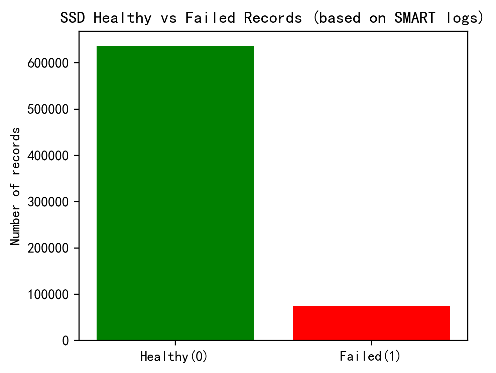
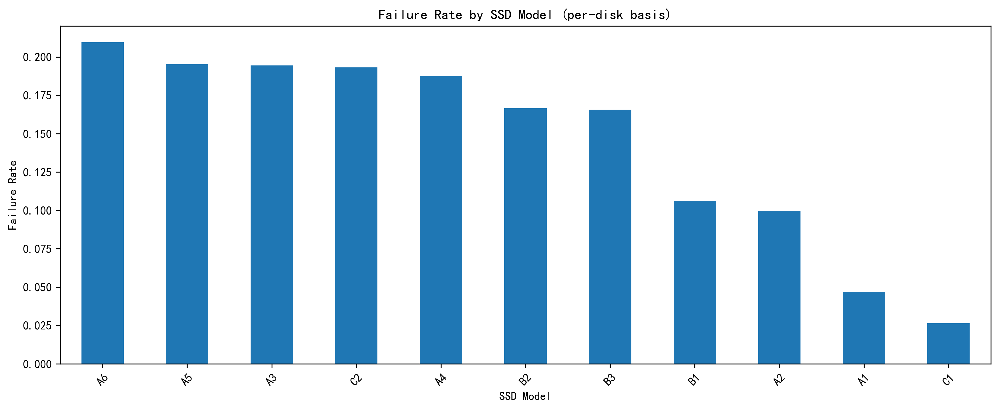
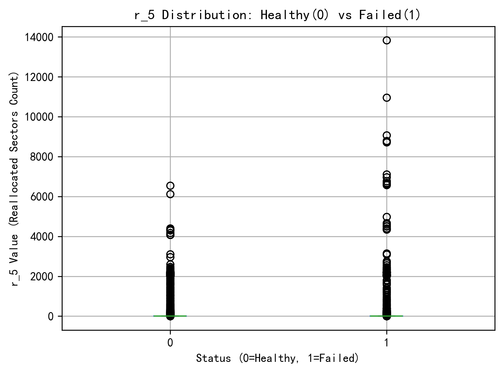
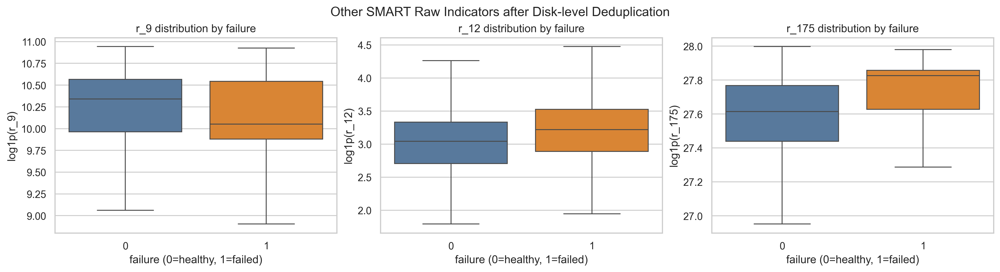
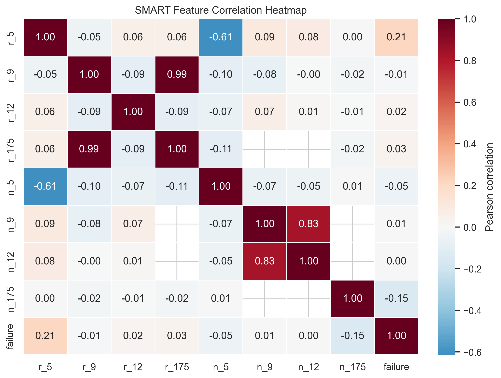
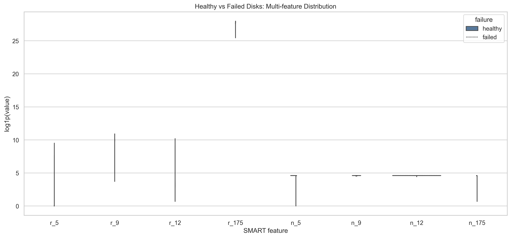
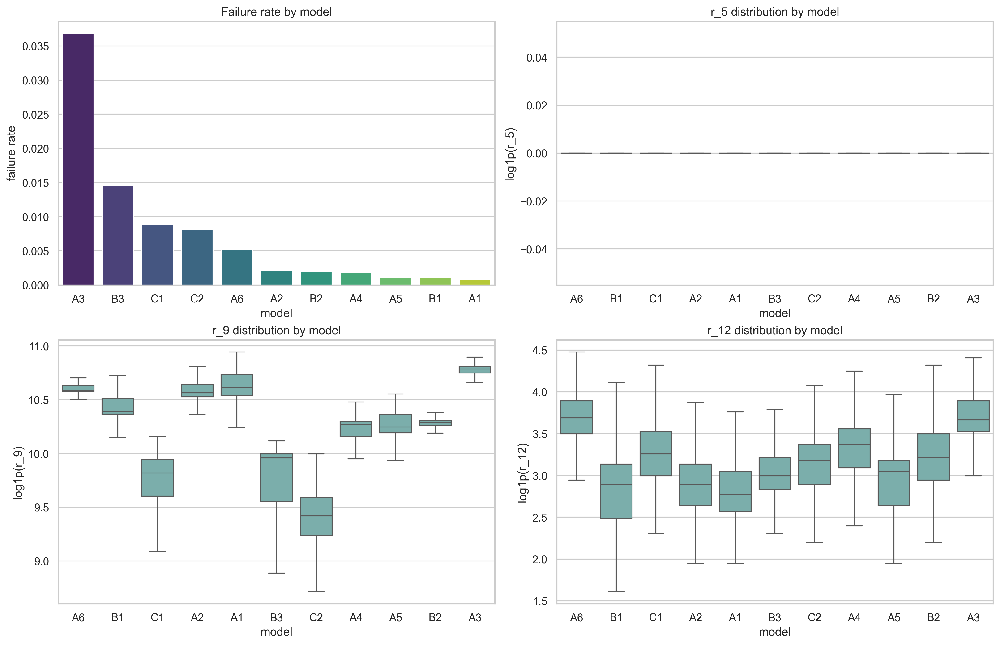
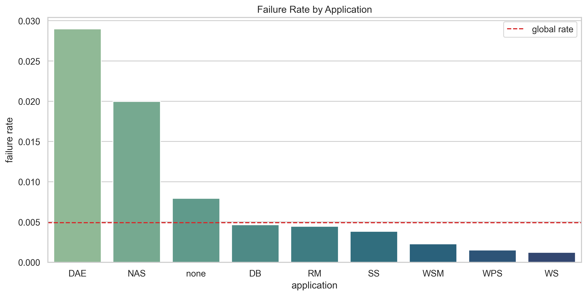
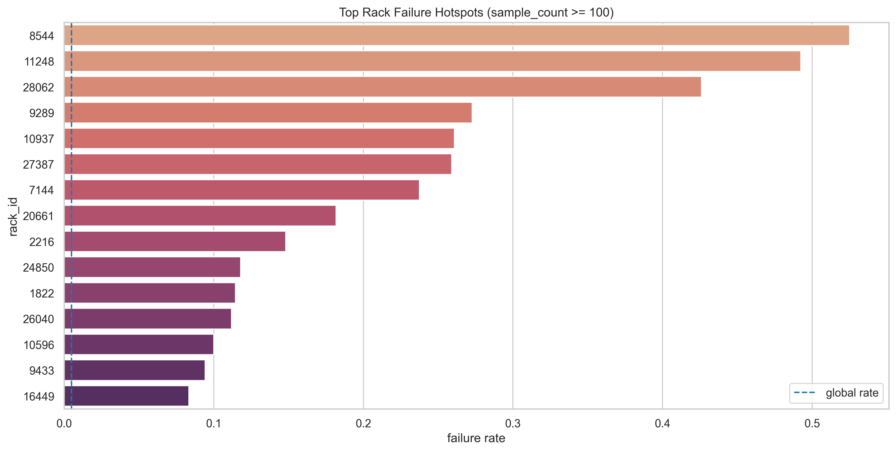
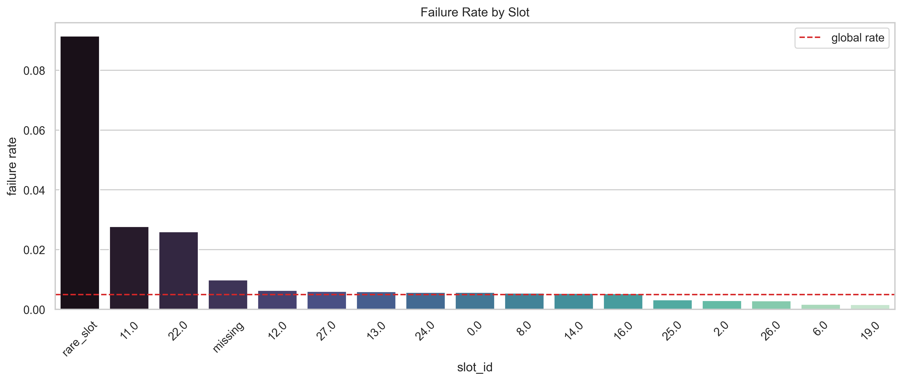

# SSD故障日志分析报告

## 1. 数据集说明

- 数据来源：阿里云公开数据集 `dcbrain/ssd_open_data`
- 本次使用的数据文件：
  - `smart_log_20191231.csv/20191231.csv`：2019-12-31 单日 SMART 日志
  - `ssd_failure_tag.csv/ssd_failure_tag.csv`：故障盘标签
  - `location_info_of_ssd.csv/location_info_of_ssd.csv`：磁盘应用、机架、节点和槽位信息
  - `merged_smart_failure.csv`：A 同学已合并的中间表
- 主要字段：`disk_id`, `ds`, `model`, `app`, `rack_id`, `node_id`, `slot_id`, `r_5`, `r_9`, `r_12`, `r_175`, `n_5`, `n_9`, `n_12`, `n_175`, `failure`
- 标签含义：`failure=0` 表示健康盘，`failure=1` 表示故障盘

## 2. 数据清洗与主键修正

A 同学的 `merged_smart_failure.csv` 是按 `disk_id` 合并得到的，但复核原始数据后发现：`disk_id` 不是全局唯一主键，同一个 `disk_id` 会出现在多个 `model` 下。因此，后续分析不能只按 `disk_id` 去重或合并，否则会把不同型号下相同编号的磁盘混在一起。

更合理的样本主键是：

`(model, disk_id)`

复核结果如下：

| 指标 | 数值 |
|---|---:|
| 原始 SMART 行数 | 706,182 |
| 原始 SMART 唯一 `disk_id` 数 | 253,420 |
| 原始 SMART 唯一 `(model, disk_id)` 数 | 706,182 |
| 故障标签行数 | 18,387 |
| 故障标签唯一 `(model, disk_id)` 数 | 18,387 |
| A 版 `disk_id` 合并后行数 | 710,570 |
| A 版合并额外增加行数 | 4,388 |
| A 版记录级故障样本数 | 74,220 |
| 修正后故障样本数 | 3,459 |
| `location_info` 匹配率 | 100.00% |
| `slot_id` 缺失率 | 18.02% |

因此，B 部分重新从原始 SMART 表和故障标签表出发，按 `(model, disk_id)` 合并。修正后的数据保存为：

`dedup_smart_failure.csv`

修正后样本分布：

| 类别 | 样本数 |
|---|---:|
| 健康 | 702,723 |
| 故障 | 3,459 |
| 健康/故障比例 | 203.16:1 |

这个比例说明数据极度不平衡，后续建模必须使用类别不平衡处理方法。

## 3. A 同学已完成的基础探索

### 3.1 整体故障记录分布

A 同学完成了基础数据读取、初步合并、健康/故障记录数统计、型号故障率统计和 `r_5` 箱线图。这些内容可以作为探索性分析的基础，但由于合并主键应修正为 `(model, disk_id)`，B 部分的统计和建模以修正后的数据为准。

### 3.2 不同型号 SSD 故障率

不同型号之间故障率差异明显，说明 `model` 是后续分析中必须保留的重要分组变量。

### 3.3 关键 SMART 指标：r_5

修正主键后，故障盘 `r_5` 均值约为 126.40，健康盘约为 7.06，故障盘约为健康盘的 17.90 倍。`r_5` 是本次单日数据中最明显的故障相关指标之一。

## 4. 任务1：其他 SMART 指标分析

本部分对 `r_9`, `r_12`, `r_175` 进行修正主键后的箱线图分析。由于原始 SMART 指标跨度较大，图中使用 `log1p(value)` 缩放，以便比较健康盘和故障盘的分布差异。

修正后的指标对比如下：

| 指标 | 健康盘均值 | 故障盘均值 | 故障/健康均值比 | 缺失率 |
|---|---:|---:|---:|---:|
| `r_9` | 30,440.16 | 27,884.30 | 0.92 | 0.00% |
| `r_12` | 31.81 | 35.58 | 1.12 | 0.91% |
| `r_175` | 978,094,952,281.11 | 1,121,985,332,736.02 | 1.15 | 50.80% |

结论：

- `r_12` 在故障盘中略高，但差异弱于 `r_5`。
- `r_175` 在故障盘中均值更高，但缺失率约 50.80%，使用时必须谨慎。
- `r_9` 在故障盘中没有升高，均值反而略低，单独作为故障前兆不可靠。

## 5. 任务2：单日故障特征分析与多指标对比

原计划的“故障前 30 天时间趋势分析”需要连续多日 SMART 日志，但当前本地 `ssd_open_data` 只包含 2019-12-31 单日 SMART 数据。因此本部分改为基于单日数据的故障特征分析。

### 5.1 多指标相关性热力图

热力图用于观察 SMART 指标之间以及指标与 `failure` 的线性相关性。整体来看，单个指标不足以完全区分故障和健康，更适合使用多指标组合建模。

### 5.2 故障盘 vs 健康盘的多变量分布

小提琴图比较了健康盘和故障盘在 8 个特征上的分布差异。图中同样使用 `log1p(value)` 缩放。结合均值统计可以得到：

- `r_5` 在故障盘中显著偏高，是最重要的单项故障信号。
- `r_12` 和 `r_175` 在故障盘中略高，但区分度不如 `r_5`。
- `n_5` 在故障盘中均值下降，说明标准化指标的下降也可能包含故障信号。
- `r_9` 单独看并没有表现为故障盘偏高。

### 5.3 按型号的故障率和指标分布

按 `(model, disk_id)` 修正主键后，不同型号的故障率排名如下：

| 型号 | 样本数 | 故障数 | 故障率 |
|---|---:|---:|---:|
| A3 | 16,774 | 617 | 3.68% |
| B3 | 38,564 | 562 | 1.46% |
| C1 | 167,879 | 1,487 | 0.89% |
| C2 | 19,776 | 162 | 0.82% |
| A6 | 12,824 | 67 | 0.52% |

结论：

- 修正合并主键后，型号故障率比 A 版 `disk_id` 合并口径低很多。
- A3 仍是故障率最高的型号，应作为重点关注对象。
- C1 样本量最大，虽然故障率不高，但故障绝对数量最多。

### 5.4 位置与业务维度的关联故障分析

`location_info` 与修正后的 `(model, disk_id)` 样本可以 100% 匹配，因此可以进一步分析故障是否与应用、机架和槽位有关。该部分比单纯继续增加 SMART 指标更有解释价值，因为数据中心中的 SSD 故障可能受到业务负载、机架环境和物理部署位置影响。

#### 5.4.1 不同应用的故障率

| 应用 | 样本数 | 故障数 | 故障率 | 相对整体故障率倍数 |
|---|---:|---:|---:|---:|
| DAE | 13,324 | 386 | 2.90% | 5.91 |
| NAS | 12,977 | 259 | 2.00% | 4.07 |
| none | 182,794 | 1,451 | 0.79% | 1.62 |
| DB | 25,393 | 118 | 0.46% | 0.95 |
| RM | 82,952 | 370 | 0.45% | 0.91 |

DAE 和 NAS 的故障率明显高于整体平均水平，说明业务类型可能与 SSD 失效风险有关。可能原因包括不同应用的读写压力、访问模式或部署环境不同。

#### 5.4.2 高故障机架热点

为避免小样本造成误判，机架分析只展示样本数不少于 100 的 `rack_id`。结果显示部分机架存在明显故障聚集：

| rack_id | 样本数 | 故障数 | 故障率 | 相对整体故障率倍数 |
|---|---:|---:|---:|---:|
| 8544 | 120 | 63 | 52.50% | 107.18 |
| 11248 | 132 | 65 | 49.24% | 100.53 |
| 28062 | 108 | 46 | 42.59% | 86.96 |
| 9289 | 121 | 33 | 27.27% | 55.68 |
| 10937 | 138 | 36 | 26.09% | 53.26 |

这些机架的故障率远高于整体水平，说明故障并非完全随机分布，存在明显空间聚集现象。这一结果适合放在“关联故障分析”中解释，也比单纯依赖单盘 SMART 指标更接近数据中心运维场景。

#### 5.4.3 槽位差异

`slot_id` 缺失率约 18.02%。为降低小样本波动影响，样本数少于 100 的槽位在建模时合并为 `rare_slot`。样本量足够的槽位中，`slot_id=11` 和 `slot_id=22` 的故障率明显偏高，分别为 2.77% 和 2.60%，约为整体故障率的 5 倍以上。

位置分析结论：

- `app`、`rack_id`、`slot_id` 均能揭示故障分布差异。
- `rack_id` 和 `node_id` 类别数过多，直接加入预测模型容易过拟合，因此只用于关联故障分析。
- `app` 和分组后的 `slot_id` 类别数可控，可以加入预测模型作为辅助特征。

## 6. 任务3：简单故障预测建模

### 6.1 建模设置

使用修正后的 `(model, disk_id)` 样本建模，避免不同型号下相同 `disk_id` 被错误合并。

本次建模分为三个版本：

- Baseline：只使用 SMART 数值特征 `r_5`, `r_9`, `r_12`, `r_175`, `n_5`, `n_9`, `n_12`, `n_175`
- Model-aware：在 Baseline 基础上加入 `model` 型号特征，并对 `model` 做独热编码
- Location-aware：继续加入 `app` 和分组后的 `slot_id`，但不加入高基数的 `rack_id` 和 `node_id`

模型流程：

- 缺失值使用训练集中的中位数填充
- 对数值特征进行标准化
- 使用逻辑回归模型
- 设置 `class_weight='balanced'` 处理极端类别不平衡
- 按 8:2 划分训练集和测试集，并保持标签比例一致
- 使用 ROC-AUC、Average Precision、故障召回率和 Top-K 命中率评估模型

### 6.2 模型结果

| 指标 | Baseline：SMART | Model-aware：SMART + model | Location-aware：SMART + model + app + slot |
|---|---:|---:|---:|
| 训练集样本数 | 564,945 | 564,945 | 564,945 |
| 测试集样本数 | 141,237 | 141,237 | 141,237 |
| Accuracy | 0.6908 | 0.7206 | 0.8065 |
| Failed Precision | 0.0130 | 0.0139 | 0.0197 |
| Failed Recall | 0.8280 | 0.8020 | 0.7890 |
| Failed F1 | 0.0256 | 0.0274 | 0.0384 |
| ROC-AUC | 0.7993 | 0.8208 | 0.8495 |
| Average Precision | 0.0214 | 0.0385 | 0.0385 |

测试集故障样本占比只有 0.49%，随机排序的 Average Precision 约等于 0.0049。Location-aware 模型的 Average Precision 为 0.0385，约为随机水平的 7.9 倍，说明模型确实学到了一些故障相关信号。

Location-aware 模型混淆矩阵：

|  | 预测健康 | 预测故障 |
|---|---:|---:|
| 实际健康 | 113,366 | 27,179 |
| 实际故障 | 146 | 546 |

Top-K 排名命中情况：

| 排名前 K 个高风险样本 | 命中故障数 | Precision@K | Recall@K |
|---|---:|---:|---:|
| 100 | 23 | 23.00% | 3.32% |
| 500 | 36 | 7.20% | 5.20% |
| 1,000 | 40 | 4.00% | 5.78% |
| 3,000 | 91 | 3.03% | 13.15% |
| 5,000 | 167 | 3.34% | 24.13% |

解释：

- 修正主键后，故障样本占比约 0.49%，类别极度不平衡。
- 加入 `model` 后，ROC-AUC 从 0.7993 提升到 0.8208，Average Precision 从 0.0214 提升到 0.0385，说明型号信息对故障风险有解释力。
- 继续加入 `app` 和 `slot_id` 后，ROC-AUC 提升到 0.8495，故障类精确率从 1.39% 提升到 1.97%，误报数量也减少。
- Location-aware 模型召回了约 78.90% 的故障样本，但误报仍然较多，因此它适合作为课程作业中的风险排序模型，不适合直接作为生产环境自动告警模型。

### 6.3 特征重要性

Location-aware 模型中逻辑回归系数绝对值排名靠前的特征为：

| 特征 | 系数 |
|---|---:|
| `model_B3` | 6.6253 |
| `model_B2` | 4.1159 |
| `model_A1` | -4.0785 |
| `model_A4` | -3.9663 |
| `slot_id_grouped_11.0` | 3.8434 |
| `model_B1` | 3.6995 |
| `model_A5` | -3.6404 |
| `model_A2` | -3.5335 |
| `slot_id_grouped_rare_slot` | 3.1616 |
| `model_A6` | -2.5383 |
| `r_9` | 2.4346 |
| `model_C2` | 2.3076 |
| `n_9` | 2.1714 |
| `slot_id_grouped_22.0` | 1.7395 |
| `app_DAE` | 1.5383 |

系数只能说明在线性模型中的相对贡献方向和大小，不能直接等同于因果关系。`model` 特征排名靠前，说明不同型号之间的基准故障风险差异较大；`slot_id` 和 `app` 进入重要特征，说明位置和业务部署信息确实补充了单盘 SMART 指标无法表达的环境/负载差异。考虑到 `r_175` 缺失率较高，以及当前只有单日 SMART 数据，后续如果要进一步提高效果，应加入完整时间序列 SMART 日志，或尝试更适合不平衡数据的树模型和阈值调优。

## 7. 输出文件说明

B 部分新增脚本和产物如下：

- 分析脚本：`b_analysis.py`
- 修正主键后的数据：`dedup_smart_failure.csv`
- 其他 SMART 指标箱线图：`figures/smart_other_boxplots.png`
- 多指标相关性热力图：`figures/smart_correlation_heatmap.png`
- 多指标小提琴图：`figures/smart_multi_metric_violin.png`
- 型号故障率与指标分布图：`figures/model_failure_and_metrics.png`
- 应用故障率图：`figures/location_app_failure_rate.png`
- 槽位故障率图：`figures/location_slot_failure_rate.png`
- 高故障机架图：`figures/location_rack_hotspots.png`
- 指标对比结果：`results/indicator_failure_comparison.csv`
- 型号故障率统计：`results/model_failure_feature_summary.csv`
- 应用故障率统计：`results/app_failure_summary.csv`
- 槽位故障率统计：`results/slot_failure_summary.csv`
- 高故障机架统计：`results/rack_failure_hotspots.csv`
- 模型评估结果：`results/failure_prediction_metrics.json`
- 模型系数：`results/logistic_regression_coefficients.csv`
- 混淆矩阵：`results/model_confusion_matrix.csv`

## 8. 总结与建议

本次 B 部分完成了其他 SMART 指标分析、单日多指标故障特征分析和简单故障预测建模。更重要的是，复核后修正了主键问题：`disk_id` 不能单独作为唯一磁盘标识，后续分析必须使用 `(model, disk_id)`。

主要结论如下：

- A 版按 `disk_id` 合并会造成跨型号误匹配，故障标签被明显放大。
- 修正后故障样本只有 3,459 条，健康/故障比例约 203.16:1。
- `r_5` 在故障盘中显著偏高，是最值得关注的单项指标。
- `r_12` 和 `r_175` 有一定差异，但 `r_175` 缺失率超过 50%，不能单独依赖。
- A3 是修正口径下故障率最高的型号。
- `location_info` 与样本完全匹配，加入后能解释应用、机架和槽位层面的故障聚集现象。
- DAE、NAS 应用故障率明显高于整体平均水平，部分机架存在极强的故障聚集。
- 加入 `model`、`app` 和 `slot_id` 后，模型 ROC-AUC 提升到 0.8495，故障精确率和误报情况也有所改善。
- 当前模型仍是单日数据上的风险排序模型，不是生产级预测系统。若要做更可靠的预测，应继续加入完整时间序列 SMART 日志，或使用更适合极端不平衡数据的模型与阈值策略。
